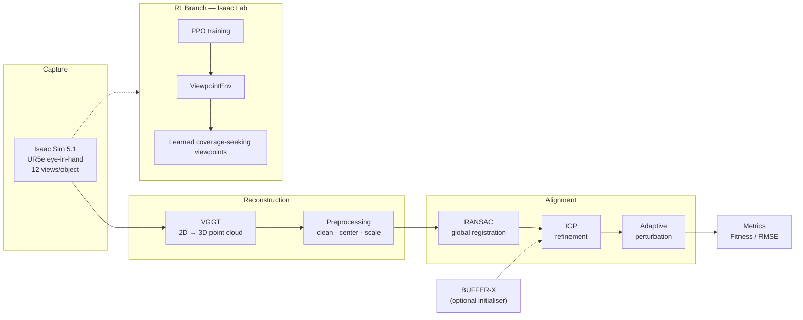

<div align="center">

#  Robotic Viewpoint Acquisition for 3D-Reconstruction


**Camera-Orientation Effects in Robotic Viewpoint Acquisition for Feed-Forward 3D Reconstruction in
Manufacturing Inspection Workcells**


[](LICENSE)
[](https://www.python.org/downloads/release/python-3100/)


[Key Results](#-key-results) ·
[Installation](#-installation) ·
[Quick Start](#-quick-start) ·
[Documentation](#-documentation) 


</div>

---

## 📖 Overview

**Robotic Viewpoint Acquisition for 3D-Reconstruction** investigates how the camera trajectory a robot uses to scan an object affects the quality of AI-based 3D reconstruction. Using a UR5e robot with an eye-in-hand camera in Isaac Sim, the project evaluates **five scanning patterns**, **two camera orientation strategies**, and **three reconstruction models** (VGGT, Fast3R, SAM3D) — and trains a **reinforcement-learning agent** in Isaac Lab that learns to select informative viewpoints autonomously.

Two findings stand out: **camera orientation is a first-order controllable factor in reconstruction quality, improving every
tested scan pattern** in reconstruction quality, and **proximity shaping rewards are essential for RL convergence**.

## 🏗️ Pipeline Architecture



<details>
<summary><b>Stage-by-stage summary</b></summary>

| Stage | Module | Purpose |
|-------|--------|---------|
| Capture | [`src/capture/capture_images.py`](src/capture/capture_images.py) | Move camera through N viewpoints in Isaac Sim, save PNG frames |
| Reconstruction | [`src/reconstruction/vggt_reconstruct.py`](src/reconstruction/vggt_reconstruct.py) | VGGT inference → confidence-filtered PLY point cloud |
| Full pipeline | [`src/reconstruction/vggt_icp_pipeline.py`](src/reconstruction/vggt_icp_pipeline.py) | Reconstruction + scale estimation + RANSAC + ICP + adaptive refinement |
| Registration baseline | [`src/registration/bufferx_pipeline.py`](src/registration/bufferx_pipeline.py) | BUFFER-X + ICP batch evaluation |
| Preprocessing | [`src/preprocessing/`](src/preprocessing/) | Mesh format conversion, centering at origin |
| RL | [`src/rl/viewpoint_env.py`](src/rl/viewpoint_env.py) | UR5e viewpoint-selection environment (PPO, proximity shaping) |

</details>

## 📊 Key Results

### Reconstruction quality — 28 objects 

| Model | Fitness ↑ | RMSE (m) ↓ | Density (pts) | Time (s) |
|-------|-----------|------------|---------------|----------|
| **VGGT** | **0.93** | **0.002** | 8 200 | 7 |
| SAM3D | 0.91 | 0.008 | 45 000 | 9 |
| Fast3R | 0.89 | 0.010 | 5 600 | 7 |

### Camera orientation is the dominant factor 

| Approach | Strategy | Fitness ↑ | RMSE (m) ↓ |
|----------|----------|-----------|------------|
| Approach 1 | Camera axis fixed downward | 0.68 | 0.035 |
| **Approach 2** | **Camera pointing at object** | **0.79** | **0.022** |

**Best fixed strategy:** Hemisphere trajectory + object-pointing orientation → Fitness 0.86, RMSE 0.015 m (single-object
trajectory experiment)

### Registration

| Method | Fitness ↑ | Recall ↑ |
|--------|-----------|----------|
| ICP | **0.87** | **78.6%** |
| BUFFER-X | 0.81 | 67.9% |

### RL viewpoint selection

| Experiment | Success Rate | Mean Reward | Coverage |
|------------|--------------|-------------|----------|
| exp_06 (no proximity shaping) | 0.4% | 22.5 | 20.6% |
| **exp_07 (proximity shaping)** | **45.2%** | **32.7** | **75%+** |

Full per-experiment metrics: [`results/metrics/reconstruction_results.csv`](results/metrics/reconstruction_results.csv)

## 🔬 Scientific Findings

1. **Camera orientation is the single largest controllable factor** in reconstruction quality. Switching from fixed-downward to object-pointing improves ICP fitness by +16 % (0.68 → 0.79) with no other changes.

2. **VGGT outperforms Fast3R and SAM3D** on alignment quality (Fitness 0.93 vs 0.89 and 0.91) while matching Fast3R on speed.

3. **Hemisphere + Approach 2 is the best fixed scanning strategy** (Fitness 0.86, RMSE 0.015 m across 28 objects).

4. **Proximity shaping rewards are essential for RL convergence** — without them, coverage rewards never activate (0.4% success rate).

5. **Scale mismatch** between metric-free VGGT outputs and GT meshes is resolved via a 3-estimator consensus (bbox diagonal, PCA axes, convex hull volume).

The full methodology is described in [`docs/methodology.md`](docs/methodology.md).

## 🔧 Installation

### Prerequisites

| Requirement | Version |
|-------------|---------|
| NVIDIA GPU | ≥ 24 GB VRAM (tested: RTX A6000 47 GB) |
| CUDA | 11.8 or 12.4 |
| Conda | ≥ 23.0 |
| Isaac Sim | 5.1 (image capture) |
| Isaac Lab | 0.48 (RL training) |

### Setup

```bash
# 1. Clone
git clone https://github.com/Adam-yes/robotic-viewpoint-acquisition-for-3d-reconstruction.git 
cd robotic-viewpoint-acquisition-for-3d-reconstruction

# 2. VGGT environment (reconstruction)
conda env create -f environment_vggt.yml
conda activate vggt

# 3. BUFFER-X / Open3D environment (registration & evaluation)
conda env create -f environment_bufferx.yml
conda activate bufferx_o3d
```

## 🚀 Quick Start

```bash
# 1. Center your ground-truth mesh
python src/preprocessing/bring_to_center.py data/raw/my_object/object.stl

# 2. Reconstruct from images (activate vggt env first)
conda activate vggt
export PYTORCH_CUDA_ALLOC_CONF=expandable_segments:True
python src/reconstruction/vggt_reconstruct.py \
    --image_dir data/raw/my_object/images \
    --out_ply   data/processed/my_object/points.ply

# 3. Full reconstruction + ICP alignment pipeline
python src/reconstruction/vggt_icp_pipeline.py \
    --scene_dir  data/raw/my_object \
    --object_ply data/raw/my_object/object.ply \
    --no_plane_removal

# 4. Batch BUFFER-X evaluation
conda activate bufferx_o3d
python src/registration/bufferx_pipeline.py \
    --recon-root data/processed \
    --gt-root    data/raw \
    --output-base data/runs \
    --bufferx-root ~/BUFFER-X \
    --manual-mode off

# 5. Run tests
python -m pytest tests/ -v
```

All pipeline parameters live in [`config/pipeline_config.yaml`](config/pipeline_config.yaml); command-line arguments override individual keys.

## 📁 Repository Structure

```
path-matters-robotic-3d-reconstruction/
├── src/                       Core pipeline code
│   ├── capture/               Isaac Sim image capture
│   ├── reconstruction/        VGGT reconstruction + full ICP pipeline
│   ├── registration/          BUFFER-X + ICP batch evaluation
│   ├── preprocessing/         Mesh conversion and centering
│   ├── rl/                    UR5e RL viewpoint-selection environment
│   └── utils/                 Open3D visualization helpers
├── config/                    pipeline_config.yaml — all parameters
├── data/
│   ├── raw/                   (gitignored) captures & GT meshes
│   ├── processed/             (gitignored) pipeline outputs
│   └── metadata/              dataset_info.md — object list & licenses
├── docs/                      Documentation (see index below)
├── notebooks/                 exploration.ipynb — results figures
├── results/
│   ├── figures/               Publication figures
│   └── metrics/               reconstruction_results.csv
├── scripts/                   run_full_pipeline.sh — end-to-end automation
├── tests/                     pytest test suite
└── .github/                   CI workflow, templates, CODEOWNERS
```

## 📚 Documentation

| Document | Audience | Contents |
|----------|----------|----------|
| [`docs/methodology.md`](docs/methodology.md) | Researchers | Scientific approach: models, alignment, trajectories, RL reward design |
| [`docs/pipeline.md`](docs/pipeline.md) | Anyone reproducing results | Step-by-step reproduction guide with troubleshooting |
| [`docs/data_management.md`](docs/data_management.md) | Data users | Dataset layout, storage, versioning, licenses |
| [`docs/guides/isaac_sim_capture.md`](docs/guides/isaac_sim_capture.md) | Operators | Isaac Sim capture environment setup |
| [`data/metadata/dataset_info.md`](data/metadata/dataset_info.md) | Data users | Full 28-object list with sources and licenses |
| [`CONTRIBUTING.md`](CONTRIBUTING.md) | Contributors | Branch model, code style, PR checklist |

For reproduction of all paper tables — including troubleshooting for OOM errors, white images, and rotation offsets — start with [`docs/pipeline.md`](docs/pipeline.md).

## 🖥️ Hardware

| Component | Specification |
|-----------|---------------|
| Robot | Universal Robots UR5e (eye-in-hand) |
| GPU | NVIDIA RTX A6000 (47 GB) |
| CPU | Intel Core i9-14900K |
| OS | Ubuntu 22.04 LTS |
| Simulator | Isaac Sim 5.1 + Isaac Lab 0.48 |

## 🤝 Contributing

Contributions are welcome — see [`CONTRIBUTING.md`](CONTRIBUTING.md) for the branch model, code style, and PR checklist. This project follows the [Contributor Covenant Code of Conduct](CODE_OF_CONDUCT.md).


## 🙏 Acknowledgements

Built on [VGGT](https://huggingface.co/facebook/VGGT-1B) (Meta AI), [BUFFER-X](https://github.com/BufferX), [Open3D](https://www.open3d.org/), and [NVIDIA Isaac Sim / Isaac Lab](https://isaac-sim.github.io/IsaacLab). Conducted at TU Berlin IAT.

## ⚖️ License

This project is licensed under the MIT License — see [`LICENSE`](LICENSE).

Ground-truth meshes from YCB-V and T-LESS are licensed CC-BY-NC. See [`data/metadata/dataset_info.md`](data/metadata/dataset_info.md) for details.
